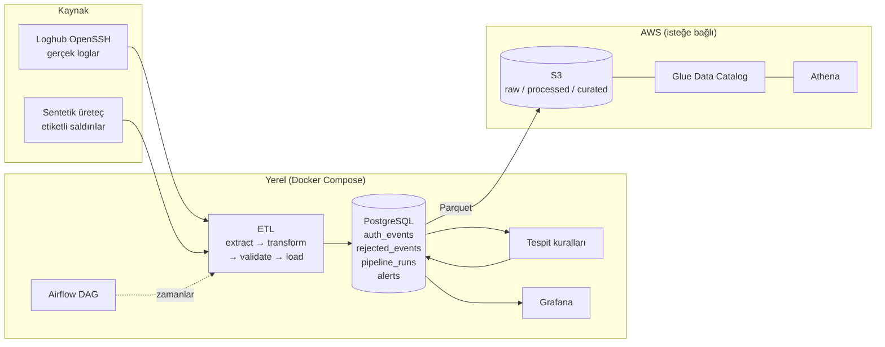

# Cybersecurity Data Lake & Threat Analytics Platform

[](https://github.com/yigitfevzitugrul/Cybersecurity-Data-Lake-Threat-Analytics-Platform/actions/workflows/tests.yml)

SSH kimlik doğrulama loglarını toplayan, ETL'den geçiren, veri kalitesini denetleyen, tehditleri kural tabanlı olarak tespit eden, sonuçları Grafana'da gösteren ve veriyi AWS üzerinde bir data lake'e taşıyan uçtan uca bir veri mühendisliği projesi.

Bilişim Sistemleri Mühendisliği bitirme projesi olarak geliştirilmiştir.

## Mimari



| Katman | Teknoloji |
|---|---|
| Dil ve test | Python 3.12, pytest (105 test), GitHub Actions |
| Depolama | PostgreSQL 16; S3 üzerinde Parquet |
| Orkestrasyon | Apache Airflow 2.10 |
| Görselleştirme | Grafana 11 (kod olarak tanımlı veri kaynağı ve dashboard'lar) |
| Bulut | AWS S3, Glue Data Catalog, Athena, IAM, Budgets (boto3) |
| Çalışma ortamı | Docker Compose |

Öne çıkanlar:

- **Idempotent pipeline:** aynı ya da örtüşen bir dosyayı tekrar işlemek kayıt çoğaltmaz; hata olursa hiçbir şey yüklenmez.
- **Veri kalitesi:** yedi farklı red sebebi, karantina tablosu ve her çalıştırma için denetim kaydı.
- **Ölçülebilir tespit:** sentetik üreteç saldırıları etiketlediği için kuralların precision ve recall değerleri hesaplanır; sınırları açıkça raporlanır.
- **En az yetki:** Grafana salt-okunur bir veritabanı rolüyle, bulut pipeline'ı kalıcı anahtarı olmayan dar yetkili bir IAM rolüyle çalışır.

## Pipeline

```
data/raw/*.log ──extract──▶ transform ──▶ validate ──▶ load ──▶ PostgreSQL
                              │              │           ├─ auth_events      (geçerli olaylar)
                              └──────────────┴──────────▶├─ rejected_events  (karantina + red sebebi)
                                                         └─ pipeline_runs    (her çalıştırmanın denetim kaydı)
                                             auth_events ──detect──▶ alerts  (tespit kurallarının alarmları)
                                                       data/processed/*.jsonl
```

| Adım | Dosya | Görev |
|---|---|---|
| Extract | `src/etl/extract.py` | Dosyayı okur, SHA-256 parmak izini çıkarır |
| Transform | `src/etl/transform.py`, `src/etl/parser.py` | Satırları ayrıştırır, IP'yi normalize eder |
| Validate | `src/etl/validate.py` | Veri kalitesi kontrolleri |
| Load | `src/etl/load.py` | Tek transaction'da idempotent yükleme |

Red sebepleri: `malformed_line`, `invalid_timestamp`, `missing_field`, `schema_error`, `invalid_ip`, `invalid_port`, `duplicate`.

Aynı dosyayı (ya da örtüşen bir dosyayı) tekrar işlemek kayıt çoğaltmaz. Hata olursa hiçbir şey yüklenmez ve çalıştırma `failed` olarak kaydedilir.

## Kurulum

Gereksinimler: Docker Desktop, Python 3.12.

```powershell
python -m venv .venv
.venv\Scripts\Activate.ps1
pip install -r requirements.txt
Copy-Item .env.example .env   # içindeki change_me değerlerini değiştir
docker compose up -d --build --wait
```

| Servis | Adres | Giriş |
|---|---|---|
| Airflow | http://localhost:8080 | `admin` / `.env` içindeki `AIRFLOW_ADMIN_PASSWORD` |
| Grafana | http://localhost:3000 | `admin` / `.env` içindeki `GRAFANA_ADMIN_PASSWORD` |
| PostgreSQL | `localhost:5433` | `.env` içindeki `POSTGRES_USER` / `POSTGRES_PASSWORD` |

Grafana veritabanına sadece `SELECT` yetkisi olan ayrı bir rolle (`grafana_ro`) bağlanır. Veri kaynağı ve dashboard'lar `grafana/` klasöründen otomatik yüklenir.


## Airflow DAG'i

`auth_log_etl` her gün çalışır:

```
generate_daily_log ──▶ run_etl ──┬──▶ quality_gate
                                 └──▶ detect_threats ──▶ sync_to_cloud ──▶ reconcile_cloud
```

- `generate_daily_log`: gerçek bir log kaynağını taklit eder; o gün için gömülü saldırılar ve %2 bozuk satır içeren sentetik bir log üretir.
- `run_etl`: `data/raw/` altındaki henüz işlenmemiş bütün `*.log` dosyalarını pipeline'dan geçirir. Bir dosyanın işlenip işlenmediğine içeriğinin SHA-256 özetine bakarak karar verir.
- `quality_gate`: bir dosyada reddedilen satır oranı %10'u aşarsa DAG'i başarısız sayar.
- `detect_threats`: tespit kurallarını çalıştırır ve alarmları `alerts` tablosuna yazar.
- `sync_to_cloud` ve `reconcile_cloud`: katmanları S3'e gönderir, ardından yerel veritabanı ile Athena'nın aynı satır sayılarını verdiğini doğrular. Varsayılan kurulumda bu iki adım atlanır; bkz. [DAG'den buluta gönderme](#dagden-buluta-gönderme).

DAG ilk kurulumda duraklatılmış gelir. Arayüzden açabilir ya da komut satırından tetikleyebilirsin:

```powershell
docker compose exec airflow-scheduler airflow dags unpause auth_log_etl
docker compose exec airflow-scheduler airflow dags trigger auth_log_etl
```

## Tehdit tespiti

Kurallar `src/detection/rules.py` içinde, eşikler [config/detection_rules.yaml](config/detection_rules.yaml) dosyasındadır.

| Kural | Ne arar | Varsayılan eşik |
|---|---|---|
| `brute_force` | Aynı IP'den aynı kullanıcıya kısa sürede çok başarısız deneme | 5 dakikada 10 deneme |
| `password_spray` | Aynı IP'den çok farklı kullanıcıya, her birine az deneme | 30 dakikada 10 kullanıcı, kullanıcı başına ortalama en fazla 3 deneme |
| `suspicious_ip` | `root` ya da var olmayan kullanıcılara yönelik denemeler; çok sunucuyu yoklayan IP | 60 dakikada 5 deneme ya da 3 farklı sunucu |
| `auth_anomaly` | Olağandışı başarılı giriş: çok başarısızlıktan sonra giriş, kullanıcı için yeni IP, mesai dışı saat | 5 başarısız deneme / 3 girişlik geçmiş / 07:00–20:00 dışı |

```powershell
python -m src.detection.engine            # kuralları çalıştır, alarmları yaz
python -m src.detection.engine --reset    # eşik değiştirdikten sonra: eski alarmları silip yeniden üret
python -m src.detection.evaluate          # doğruluğu sentetik etiketlere karşı ölç
```

Tespit her çalıştığında bütün olayları yeniden değerlendirir; aynı alarm ikinci kez eklenmez, güncellenir.


### Doğruluk ölçümü

Sentetik üreteç her saldırıyı etiketlediği için kuralların doğruluğu ölçülebilir. Üreteç `--hard-cases` ile kuralları bilerek zorlayan iki durum da ekler: eşiklerin altında kalan **yavaş brute force** ve şifresini unutup kendi IP'sinden art arda yanlış deneme yapan **gerçek kullanıcı**.

10 günlük sentetik veri (50 etiketli saldırı, 84 alarm) üzerindeki sonuç:

| Saldırı tipi | Beklenen kural | Yakalanan | Recall |
|---|---|---|---|
| Brute force | `brute_force` | 10/10 | %100 |
| Password spraying | `password_spray` | 10/10 | %100 |
| Başarısızlıklar sonrası başarılı giriş | `auth_anomaly` | 10/10 | %100 |
| Gece saatinde yeni IP'den giriş | `auth_anomaly` | 10/10 | %100 |
| Yavaş brute force | `brute_force` | 0/10 | %0 |

| Kural | Doğru alarm | Precision |
|---|---|---|
| `brute_force` | 20/30 | %66,7 |
| `password_spray` | 10/10 | %100 |
| `suspicious_ip` | 14/14 | %100 |
| `auth_anomaly` | 20/30 | %66,7 |

Genel recall %80, precision %76,2. Önem derecesi `high` ya da `critical` olan 37 alarmın tamamı gerçek saldırıdır.

Bu sonuçlar kural tabanlı tespitin bilinen sınırlarını gösterir:

- Yavaş brute force, kayan pencere eşiğinin altında kaldığı için `brute_force` kuralıyla yakalanamaz. Hedef `root` olduğunda `suspicious_ip` kuralı yine de alarm üretir (saldırıların %84'ü en az bir kuralla yakalanır).
- Yanlış alarmların tamamı şifresini unutan kullanıcıdan gelir. `auth_anomaly`, giriş kullanıcının bilinen IP'sinden geldiğinde önem derecesini `medium`'a düşürür; `brute_force` ise kullanıcı geçmişine bakmadığı için bunu ayırt edemez.
- Sonuçlar sentetik veriye aittir; gerçek trafikte oranlar farklı olacaktır. Loghub verisinin etiketi olmadığı için ölçüme girmez.

## AWS Data Lake

Yerel katmanlar aynı mantıkla S3'e taşınır ve Athena ile sorgulanır:

```
s3://<bucket>/
├── raw/auth_logs/<dosya>.log                               ham loglar
├── processed/auth_events/event_date=YYYY-MM-DD/*.parquet   doğrulanmış olaylar (güne göre bölümlü)
├── curated/alerts/, curated/daily_ip_summary/              alarmlar ve günlük IP özeti
└── athena-results/                                         sorgu sonuçları (7 gün sonra silinir)
```

| Bileşen | Ne yapıldı |
|---|---|
| S3 | Herkese açık erişim kapalı, sunucu tarafı şifreleme, TLS dışı istekler bucket politikasıyla reddedilir |
| Glue Data Catalog | `auth_events`, `alerts`, `daily_ip_summary` tabloları. Bölümler *partition projection* ile S3 yolundan hesaplanır; crawler çalıştırmak gerekmez |
| Athena | Ayrı workgroup; sorgu başına en fazla 100 MB taranabilir (maliyet koruması) |
| IAM | Pipeline, kalıcı erişim anahtarı olmayan bir rolü üstlenir (`sts:AssumeRole`, 1 saatlik geçici kimlik). Yetkileri [infra/iam/pipeline_policy.json](infra/iam/pipeline_policy.json) dosyasındadır |
| Budgets | Aylık maliyet bütçesi; gerçekleşen harcama %80'i ya da tahmin %100'ü aşınca e-posta |

Pipeline rolü sadece kendi bucket'ındaki üç katmana yazabilir, Glue kataloğunu okuyabilir ve kendi workgroup'unda sorgu çalıştırabilir. Nesne silemez, başka bucket'ları göremez, tablo ya da IAM ayarı değiştiremez.

Kurulum için `aws configure` ile yapılandırılmış yönetici yetkili bir AWS kimliği gerekir. `.env` içindeki AWS ayarlarını doldurduktan sonra:

```powershell
python -m src.cloud.setup          # altyapıyı kurar; çıktıdaki rol ARN'ını .env'e yaz
python -m src.cloud.sync           # raw / processed / curated katmanlarını S3'e gönderir
python -m src.cloud.athena sql/athena/01_lake_analysis.sql
python -m src.cloud.verify_access  # rolün en az yetkiyle çalıştığını canlı doğrular
python -m src.cloud.reconcile      # yerel veritabanı ile Athena'yı karşılaştırır
```

`setup` ve `sync` tekrar çalıştırılabilir: var olan kaynaklar güncellenir, içeriği değişmemiş nesneler yeniden yüklenmez.

Maliyet: bu veri boyutunda (yaklaşık 1 MB) S3, Glue kataloğu ve Athena sorguları pratikte ücretsizdir; örnek analiz dosyasının tamamı 17 KB veri tarar. Bucket kullanılmadığı dönemde silinebilir; `setup` ve `sync` ile birkaç dakikada yeniden oluşturulur.

### DAG'den buluta gönderme

Varsayılan kurulumda konteynerlerde AWS kimliği bulunmaz ve DAG'in bulut adımları atlanır. Açmak için servisleri ek dosyayla başlat:

```powershell
docker compose -f docker-compose.yml -f docker-compose.cloud.yml up -d --wait
```

[docker-compose.cloud.yml](docker-compose.cloud.yml), makinedeki `~/.aws` klasörünü Airflow konteynerlerine salt-okunur bağlar. DAG bu kimlikle yalnızca en az yetkili pipeline rolünü üstlenir. Kapatmak için servisleri ek dosya olmadan yeniden başlatmak yeterlidir.

Kaynakları kaldırmak için:

```powershell
aws s3 rb s3://<bucket> --force
aws glue delete-database --name security_lake
aws athena delete-work-group --work-group secdl --recursive-delete-option
aws iam delete-role-policy --role-name secdl-pipeline --policy-name secdl-pipeline-access
aws iam delete-role --role-name secdl-pipeline
aws budgets delete-budget --account-id <hesap-no> --budget-name secdl-monthly
```

## Kullanım

Gerçek veri: [Loghub OpenSSH_2k.log](https://github.com/logpai/loghub/tree/master/OpenSSH) dosyasını `data/raw/` altına koy. Syslog satırında yıl yoktur; `--year` verilmezse dosyanın değişiklik tarihinden tahmin edilir.

```powershell
python -m src.etl.pipeline data/raw/OpenSSH_2k.log --year 2025
```

Sentetik veri: gömülü saldırılar (brute force, password spraying, başarısızlıklar sonrası başarılı giriş, gece saatinde yeni IP'den giriş), isteğe bağlı bozuk satırlar (`--bad-ratio`) ve kuralları zorlayan durumlar (`--hard-cases`) içerir. Saldırı etiketleri `data/raw/synthetic_auth_labels.json` dosyasına yazılır.

```powershell
python -m src.generator.generate --start-date 2026-09-01 --days 7 --seed 42 --bad-ratio 0.02 --hard-cases
python -m src.etl.pipeline data/raw/synthetic_auth.log --year 2026
```

Analiz sorguları:

```powershell
cmd /c "docker compose exec -T postgres psql -U secdl -d security_lake < sql\analysis\01_basic_analysis.sql"
cmd /c "docker compose exec -T postgres psql -U secdl -d security_lake < sql\analysis\02_data_quality.sql"
```

## Testler

```powershell
python -m pytest -q
```

Veritabanı testleri geçici bir şemada çalışır ve geliştirme verisine dokunmaz; PostgreSQL kapalıysa atlanır. Bulut testleri AWS'ye bağlanmaz. Aynı testler her push'ta GitHub Actions üzerinde, gerçek bir PostgreSQL servisiyle çalışır.

## Proje yapısı

```
config/detection_rules.yaml    tespit kurallarının eşikleri
dags/auth_log_etl.py           Airflow DAG'i
docker/                        Airflow imajı ve veritabanı ilk kurulum betiği
grafana/                       veri kaynağı ve dashboard tanımları
infra/iam/                     pipeline rolünün IAM politikası
sql/schema/                    tablo tanımları (sırayla uygulanır)
sql/analysis/, sql/athena/     PostgreSQL ve Athena analiz sorguları
src/generator/                 sentetik log üreteci
src/etl/                       extract, parser, transform, validate, load, pipeline
src/detection/                 kurallar, tespit motoru, doğruluk ölçümü
src/cloud/                     AWS kurulumu, S3 senkronu, Athena, tutarlılık kontrolü
tests/                         pytest testleri
data/{raw,processed,curated}/  yerel veri katmanları (git'e girmez)
```

## Bilinen sınırlar

- Tespit kural tabanlıdır: eşiklerin altında kalan yavaş saldırıları kaçırır, şifresini unutan kullanıcıyı saldırıdan ayıramaz (bkz. [Doğruluk ölçümü](#doğruluk-ölçümü)).
- Tespit her çalıştırmada bütün olayları yeniden değerlendirir. Bu veri boyutunda sorun değildir; veri büyüdüğünde geriye bakış penceresi gerekir.
- Syslog satırlarında yıl yoktur. Yıl dosya tarihinden tahmin edilir; bir yıldan eski ya da yıl sınırını aşan dosyalarda `--year` elle verilmelidir.
- Yalnızca OpenSSH `Failed` / `Accepted` satırları olay sayılır; diğer servislerin logları kapsam dışıdır.
- Doğruluk sonuçları sentetik veriye aittir. Gerçek Loghub verisinin etiketi olmadığı için ölçüme girmez.
