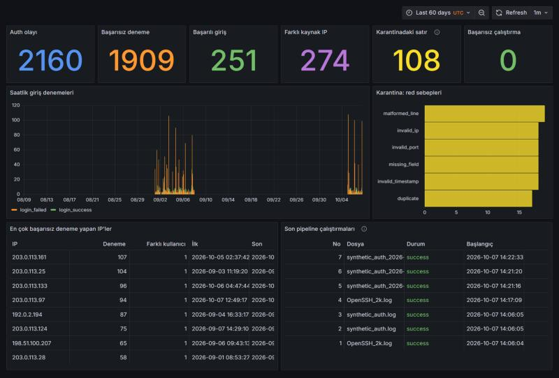
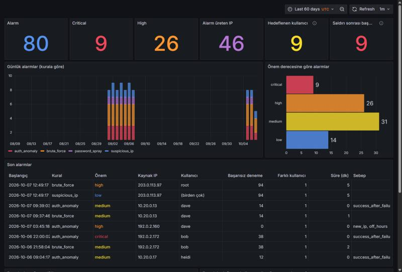

# Cybersecurity Data Lake & Threat Analytics Platform

Security/auth loglarını toplayan, ETL'den geçiren, veri kalitesini kontrol eden, AWS Data Lake'te depolayan ve tehditleri tespit edip Grafana'da görselleştiren platform.

> Durum: MVP tamamlandı (Seviye 1–4: pipeline, ETL + veri kalitesi, Docker Compose + Airflow + Grafana, tehdit tespiti). Sırada AWS Data Lake var.

## Pipeline

```
data/raw/*.log ──extract──▶ transform ──▶ validate ──▶ load ──▶ PostgreSQL
                              │              │           ├─ auth_events      (geçerli olaylar)
                              └──────────────┴──────────▶├─ rejected_events  (karantina + red sebebi)
                                                         └─ pipeline_runs    (her çalıştırmanın denetim kaydı)
                                             auth_events ──detect──▶ alerts  (tespit kurallarının alarmları)
                                                       data/processed/*.jsonl
```

| Adım | Dosya | Görev |
|---|---|---|
| Extract | `src/etl/extract.py` | Dosyayı okur, SHA-256 parmak izini çıkarır |
| Transform | `src/etl/transform.py`, `src/etl/parser.py` | Satırları ayrıştırır, IP'yi normalize eder |
| Validate | `src/etl/validate.py` | Veri kalitesi kontrolleri |
| Load | `src/etl/load.py` | Tek transaction'da idempotent yükleme |

Red sebepleri: `malformed_line`, `invalid_timestamp`, `missing_field`, `schema_error`, `invalid_ip`, `invalid_port`, `duplicate`.

Aynı dosyayı (ya da örtüşen bir dosyayı) tekrar işlemek kayıt çoğaltmaz. Hata olursa hiçbir şey yüklenmez ve çalıştırma `failed` olarak kaydedilir.

## Kurulum

Gereksinimler: Docker Desktop, Python 3.12.

```powershell
python -m venv .venv
.venv\Scripts\Activate.ps1
pip install -r requirements.txt
Copy-Item .env.example .env   # içindeki change_me değerlerini değiştir
docker compose up -d --build --wait
```

| Servis | Adres | Giriş |
|---|---|---|
| Airflow | http://localhost:8080 | `admin` / `.env` içindeki `AIRFLOW_ADMIN_PASSWORD` |
| Grafana | http://localhost:3000 | `admin` / `.env` içindeki `GRAFANA_ADMIN_PASSWORD` |
| PostgreSQL | `localhost:5433` | `.env` içindeki `POSTGRES_USER` / `POSTGRES_PASSWORD` |

Grafana veritabanına sadece `SELECT` yetkisi olan ayrı bir rolle (`grafana_ro`) bağlanır. Veri kaynağı ve dashboard'lar `grafana/` klasöründen otomatik yüklenir.



## Airflow DAG'i

`auth_log_etl` her gün çalışır:

```
generate_daily_log ──▶ run_etl ──┬──▶ quality_gate
                                 └──▶ detect_threats
```

- `generate_daily_log`: gerçek bir log kaynağını taklit eder; o gün için gömülü saldırılar ve %2 bozuk satır içeren sentetik bir log üretir.
- `run_etl`: `data/raw/` altındaki henüz işlenmemiş bütün `*.log` dosyalarını pipeline'dan geçirir. Bir dosyanın işlenip işlenmediğine içeriğinin SHA-256 özetine bakarak karar verir.
- `quality_gate`: bir dosyada reddedilen satır oranı %10'u aşarsa DAG'i başarısız sayar.
- `detect_threats`: tespit kurallarını çalıştırır ve alarmları `alerts` tablosuna yazar.

DAG ilk kurulumda duraklatılmış gelir. Arayüzden açabilir ya da komut satırından tetikleyebilirsin:

```powershell
docker compose exec airflow-scheduler airflow dags unpause auth_log_etl
docker compose exec airflow-scheduler airflow dags trigger auth_log_etl
```

## Tehdit tespiti

Kurallar `src/detection/rules.py` içinde, eşikler [config/detection_rules.yaml](config/detection_rules.yaml) dosyasındadır.

| Kural | Ne arar | Varsayılan eşik |
|---|---|---|
| `brute_force` | Aynı IP'den aynı kullanıcıya kısa sürede çok başarısız deneme | 5 dakikada 10 deneme |
| `password_spray` | Aynı IP'den çok farklı kullanıcıya, her birine az deneme | 30 dakikada 10 kullanıcı, kullanıcı başına ortalama en fazla 3 deneme |
| `suspicious_ip` | `root` ya da var olmayan kullanıcılara yönelik denemeler; çok sunucuyu yoklayan IP | 60 dakikada 5 deneme ya da 3 farklı sunucu |
| `auth_anomaly` | Olağandışı başarılı giriş: çok başarısızlıktan sonra giriş, kullanıcı için yeni IP, mesai dışı saat | 5 başarısız deneme / 3 girişlik geçmiş / 07:00–20:00 dışı |

```powershell
python -m src.detection.engine            # kuralları çalıştır, alarmları yaz
python -m src.detection.engine --reset    # eşik değiştirdikten sonra: eski alarmları silip yeniden üret
python -m src.detection.evaluate          # doğruluğu sentetik etiketlere karşı ölç
```

Tespit her çalıştığında bütün olayları yeniden değerlendirir; aynı alarm ikinci kez eklenmez, güncellenir.



### Doğruluk ölçümü

Sentetik üreteç her saldırıyı etiketlediği için kuralların doğruluğu ölçülebilir. Üreteç `--hard-cases` ile kuralları bilerek zorlayan iki durum da ekler: eşiklerin altında kalan **yavaş brute force** ve şifresini unutup kendi IP'sinden art arda yanlış deneme yapan **gerçek kullanıcı**.

10 günlük sentetik veri (50 etiketli saldırı, 84 alarm) üzerindeki sonuç:

| Saldırı tipi | Beklenen kural | Yakalanan | Recall |
|---|---|---|---|
| Brute force | `brute_force` | 10/10 | %100 |
| Password spraying | `password_spray` | 10/10 | %100 |
| Başarısızlıklar sonrası başarılı giriş | `auth_anomaly` | 10/10 | %100 |
| Gece saatinde yeni IP'den giriş | `auth_anomaly` | 10/10 | %100 |
| Yavaş brute force | `brute_force` | 0/10 | %0 |

| Kural | Doğru alarm | Precision |
|---|---|---|
| `brute_force` | 20/30 | %66,7 |
| `password_spray` | 10/10 | %100 |
| `suspicious_ip` | 14/14 | %100 |
| `auth_anomaly` | 20/30 | %66,7 |

Genel recall %80, precision %76,2. Önem derecesi `high` ya da `critical` olan 37 alarmın tamamı gerçek saldırıdır.

Bu sonuçlar kural tabanlı tespitin bilinen sınırlarını gösterir:

- Yavaş brute force, kayan pencere eşiğinin altında kaldığı için `brute_force` kuralıyla yakalanamaz. Hedef `root` olduğunda `suspicious_ip` kuralı yine de alarm üretir (saldırıların %84'ü en az bir kuralla yakalanır).
- Yanlış alarmların tamamı şifresini unutan kullanıcıdan gelir. `auth_anomaly`, giriş kullanıcının bilinen IP'sinden geldiğinde önem derecesini `medium`'a düşürür; `brute_force` ise kullanıcı geçmişine bakmadığı için bunu ayırt edemez.
- Sonuçlar sentetik veriye aittir; gerçek trafikte oranlar farklı olacaktır. Loghub verisinin etiketi olmadığı için ölçüme girmez.

## Kullanım

Gerçek veri: [Loghub OpenSSH_2k.log](https://github.com/logpai/loghub/tree/master/OpenSSH) dosyasını `data/raw/` altına koy. Syslog satırında yıl yoktur; `--year` verilmezse dosyanın değişiklik tarihinden tahmin edilir.

```powershell
python -m src.etl.pipeline data/raw/OpenSSH_2k.log --year 2025
```

Sentetik veri: gömülü saldırılar (brute force, password spraying, başarısızlıklar sonrası başarılı giriş, gece saatinde yeni IP'den giriş), isteğe bağlı bozuk satırlar (`--bad-ratio`) ve kuralları zorlayan durumlar (`--hard-cases`) içerir. Saldırı etiketleri `data/raw/synthetic_auth_labels.json` dosyasına yazılır.

```powershell
python -m src.generator.generate --start-date 2026-09-01 --days 7 --seed 42 --bad-ratio 0.02 --hard-cases
python -m src.etl.pipeline data/raw/synthetic_auth.log --year 2026
```

Analiz sorguları:

```powershell
cmd /c "docker compose exec -T postgres psql -U secdl -d security_lake < sql\analysis\01_basic_analysis.sql"
cmd /c "docker compose exec -T postgres psql -U secdl -d security_lake < sql\analysis\02_data_quality.sql"
```

## Testler

```powershell
python -m pytest -q
```

Veritabanı testleri geçici bir şemada çalışır ve geliştirme verisine dokunmaz; PostgreSQL kapalıysa atlanır.
